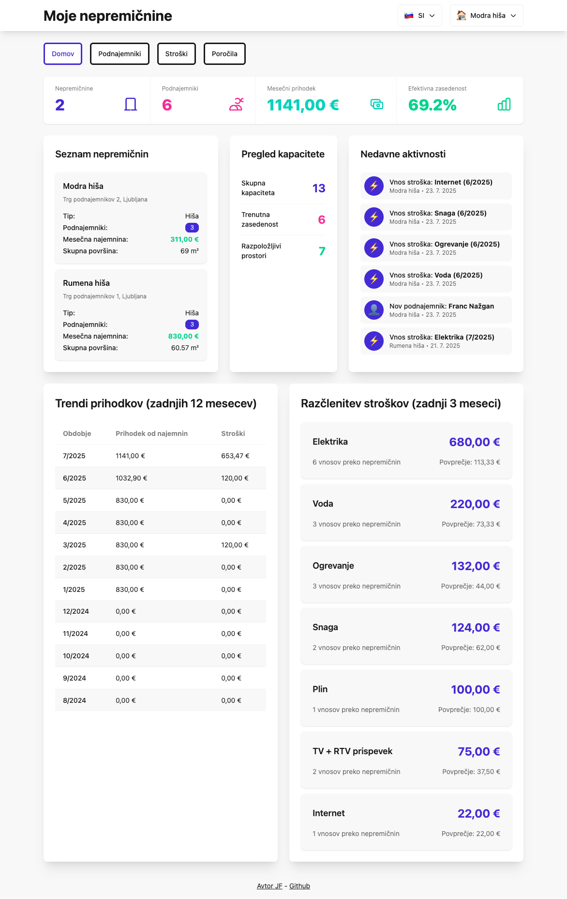
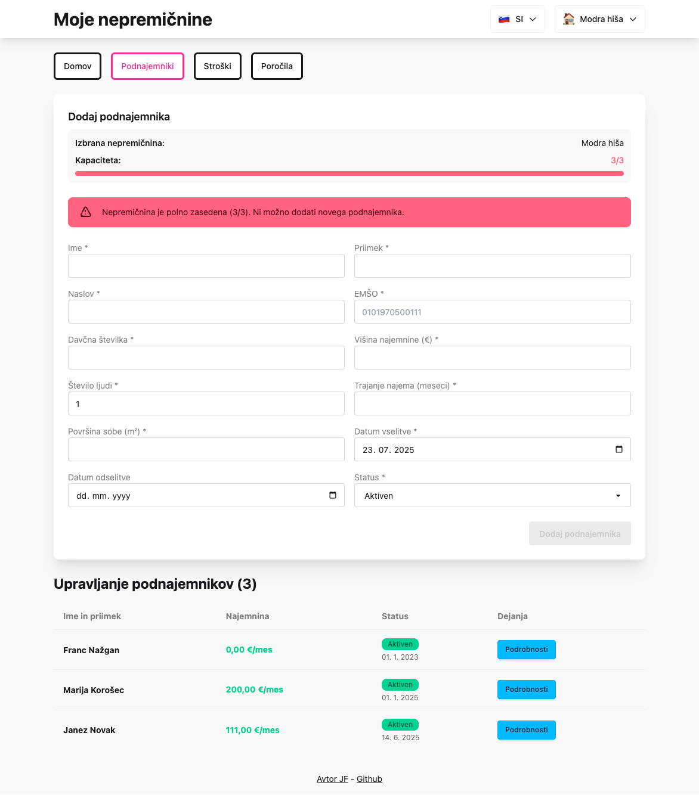
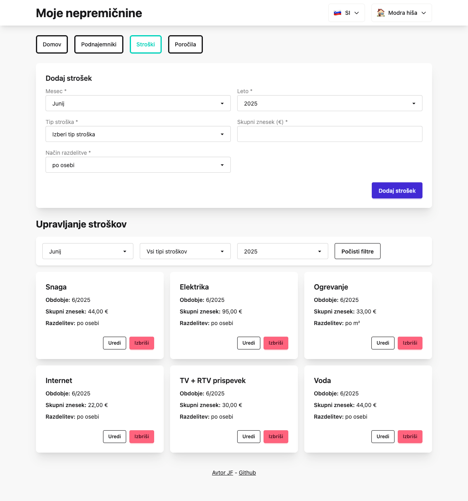
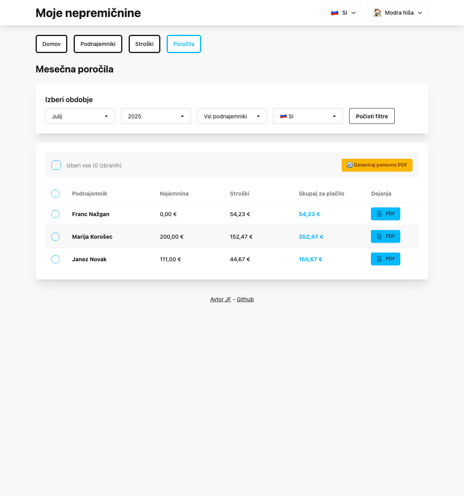
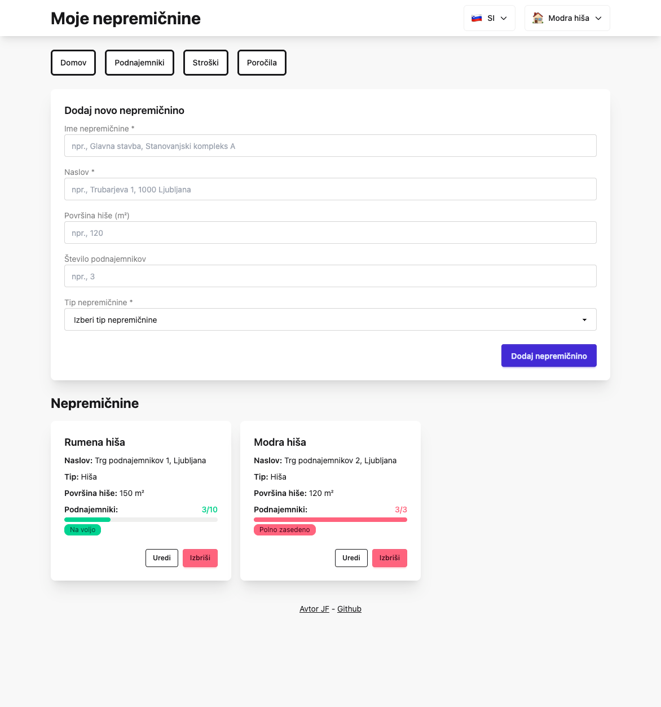

# Tenant Manager - Moje nepremičnine

Multi-property tenant management system optimized for Slovenia.

## Features

- **Multi-Property Portfolio Management**: Complete isolation and cross-property analytics
- **Advanced Utility Allocation**: Proportional per-person/per-sqm calculations with mid-month tenant handling
- **Professional PDF Reports**: Multilingual invoices with Slovenian Unicode support
- **Real-time Dashboard**: Revenue trends (12 months), occupancy metrics, capacity warnings
- **Slovenian Compliance**: EMŠO validation, tax numbers, localized formats
- **Batch Operations**: Bulk PDF export with progress tracking

 

  

 

**[PDF report example](img/tenant-report-7-2025.pdf)**

## Tech Stack

- **Backend**: Node.js, Express, PostgreSQL/SQLite
- **Frontend**: React, Vite, DaisyUI, Tailwind CSS
- **Infrastructure**: Docker, automated backups, health monitoring

## Quick Start

```bash
git clone <repository-url>
cd tennants
npm install
npm run dev
```

Access at http://localhost:3000 (frontend) and http://localhost:5999 (backend)

## Key Capabilities

### Sophisticated Calculations
- Proportional rent for mid-month move-ins/move-outs
- Person-days weighted utility allocation
- Precision math to ensure 100% cost distribution
- Cross-month utility billing logic

### Production Ready
- PostgreSQL scaling with automated migrations
- Comprehensive error handling and circuit breakers
- Database constraints and validation
- Automated backup system with integrity checks

### Slovenian Optimization
- EMŠO (Unique Master Citizen Number) validation
- Full Slovenian localization and currency formatting
- Tax compliance and address format handling
- Professional PDF reports with proper diacritics

## Architecture

```
src/
├── backend/
│   ├── database/          # Schema, migrations, constraints
│   ├── routes/           # REST API endpoints
│   ├── services/         # Business logic, PDF generation
│   └── utils/            # Precision math, error recovery
└── frontend/
    ├── components/       # React UI components
    ├── services/         # API integration
    └── locales/          # Slovenian/English translations
```

## Environment Configuration

- **Development**: SQLite with file-based storage
- **Production**: PostgreSQL with connection pooling
- **Configuration**: Environment variables via `.env`

## Scripts

- `npm run dev` - Full development environment
- `npm run server` - Backend only (port 5999)
- `npm run build` - Production frontend build
- `npm run backup` - Manual database backup
- `npm run recalculate-allocations` - Fix utility calculations

Built with help of Claude Code for property management in Slovenia.